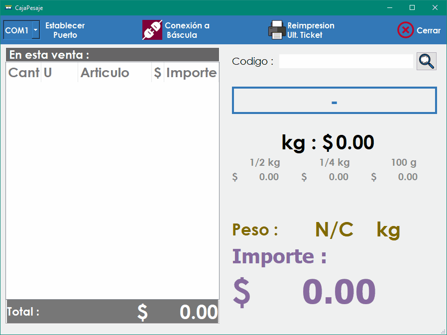

# WeighingSeller

WeighingSeller es una aplicación desarrollada en Qt 5.15.2 que permite la venta de productos con báscula, conectándose a SICAR Punto de Venta para obtener información de los productos. El programa está diseñado para obtener retroalimentación continua del peso e importe del producto, permitiendo incluir varios productos en un ticket de impresora térmica.

## Requisitos

- Qt 5.15.2
- MinGW 8.1.0
- Báscula compatible conectada mediante puerto COM (USB-Serial/USB) (modelos probados compatibles: L-EQ de Torrey, MFQ-40 de Torrey)
- Impresora térmica de 80 mm
- Base de datos MySQL de SICAR Punto de Venta

## Instalación

1. Clona este repositorio en tu máquina local.
2. Instala Qt 5.15.2 y MinGW 8.1.0 en tu sistema si aún no lo has hecho.
3. Compila el proyecto y genera el archivo ejecutable (`CajaPesaje.exe`).
4. Instala el setup `VC_redist` ubicado en la carpeta `doc/install_req/`.
5. Configura la conexión a la base de datos SICAR Punto de Venta en la aplicación modificando el archivo `ip_server.txt`.
6. Conecta la báscula compatible a tu sistema mediante el puerto COM (USB-Serial).
7. Selecciona el puerto COM correcto y presiona el botón "SET". Reinicia la aplicación.
8. Selecciona como impresora predeterminada de Windows la impresora termica.

## Uso

Para utilizar WeighingSeller:

1. Conecta la báscula compatible a tu sistema mediante el puerto COM (USB-Serial).
2. Abre la aplicación WeighingSeller.
3. El indicador de conexión mostrará el estado, cambiando a color verde para una conexión correcta.
4. Coloca el código del producto, precedido por un prefijo (por ejemplo, prefijo VERYCAR para el artículo con clave VERYCAR53), y presiona Enter para buscar.
5. Una vez encontrado el producto, verás el nombre del artículo, el precio por kilo y precios de pesos comunes de venta como 100 gramos, un cuarto, un medio.
6. Coloca el artículo en la báscula y verás cómo varía continuamente el importe, redondeado al múltiplo de $0.50 más cercano.
7. Añade un producto con la tecla +, que se verá a la izquierda en el ticket.
8. Repite este proceso para todos los productos en el ticket. Puedes borrar el último producto con la tecla -.
9. Para terminar la venta e imprimir el ticket, presiona la tecla /.

Notas:
- Para venta por pieza, después de ingresar el código del producto, introduce el número de piezas y presiona +. El artículo debe tener la ID de unidad en SICAR con un valor de 6.
- Si el producto tiene un precio 4 en SICAR, se toma como precio de oferta. Puedes activarlo presionando * después de buscar el producto.
- La impresión se realiza en la impresora predeterminada del ordenador.
- Para cambiar el puerto COM, selecciona el puerto en el administrador de dispositivos y presiona el botón "SET", luego reinicia la aplicación.
- Este programa está pensado para depender únicamente de la parte numérica de un teclado, por motivos prácticos.

## Contribuciones y Uso del Código

Este proyecto se ofrece como un recurso abierto para la comunidad, destinado a servir como ejemplo de un cajero sencillo desarrollado en Qt. Si bien puedes utilizar este código como base para adaptarlo a tus propias necesidades comerciales y realizar modificaciones para tu negocio, te animamos a hacerlo de manera responsable.

Valoramos y apoyamos la creatividad y la innovación en la adaptación de este código a diferentes contextos empresariales. Si decides hacer ajustes o mejoras, te sugerimos hacer un fork del repositorio y trabajar en tu propia versión del código.

## Contacto y Dudas

Si tienes alguna pregunta o duda sobre este proyecto, no dudes en ponerte en contacto enviando un correo electrónico a perrusquia832@gmail.com.

## Licencia

Este proyecto está bajo la Licencia MIT.
